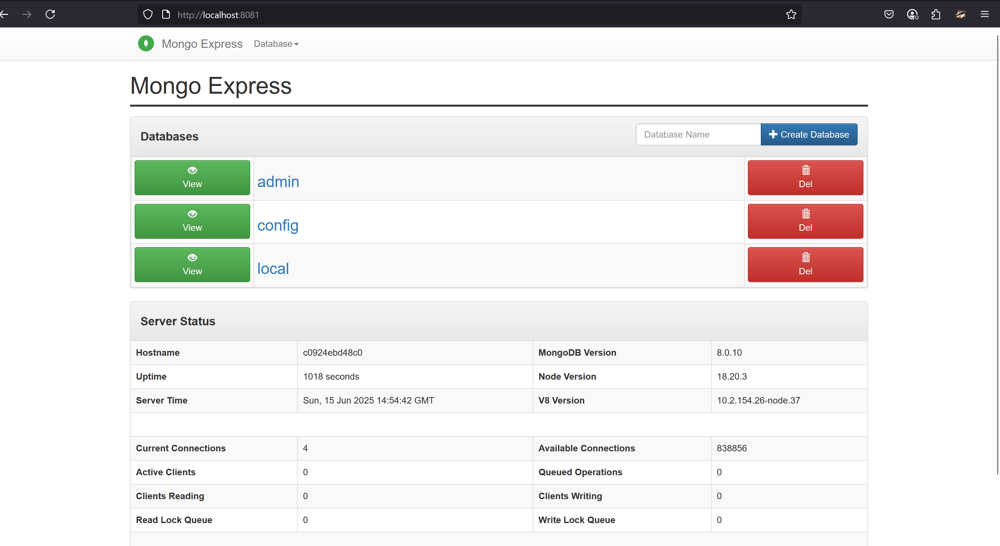
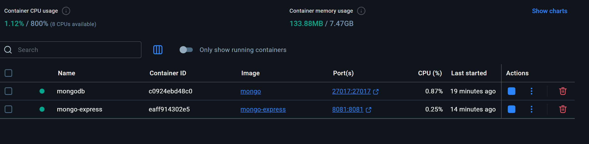

# What is Docker Compose?
- A tool that allows you to define and run multiple services and applications that belong and run together in one environment.
- A tool used to deploy and manage mutiple docker containers at once.

# Why docker compose?
- You use a single YAML file to configure and maintain your application services instead of managing all the conatiners individually
- With a single command, you can create and start all the services from your configuration
- Declarative defination

###############################################################################################
DEMO without dockercompose
###############################################################################################

# Create a bridge newtork
docker network create mongo-network 

docker network ls
PS C:\Users\riyav\OneDrive\Documents\RV\Devops\Docker> docker network ls
NETWORK ID     NAME            DRIVER    SCOPE
f2cb9ee89484   bridge          bridge    local
b8c3edd73335   host            host      local
4bb490beee99   mongo-network   bridge    local
a4a3076f7888   none            null      local

# Docker run command to start a mongo DB container
docker run -d -p 27017:27017 -e MONGO_INITDB_ROOT_USERNAME=admin -e MONGO_INITDB_ROOT_PASSWORD=admin --network mongo-network --name mongodb mongo  

# Docker run command to start a mongo express conatiner
# A mongo express conatiner is a UI for mongo DB. It serves no purpose without having the actual mongo DB server in the first place.
docker run -d -p 8081:8081 -e ME_CONFIG_MONGODB_SERVER=mongodb -e ME_CONFIG_MONGODB_ADMINUSERNAME=admin -e ME_CONFIG_MONGODB_ADMINPASSWORD=admin --network mongo-network --name mongo-express mongo-express

docker ps 
CONTAINER ID   IMAGE           COMMAND                  CREATED          STATUS          PORTS                      NAMES
eaff914302e5   mongo-express   "/sbin/tini -- /dock…"   11 minutes ago   Up 11 minutes   0.0.0.0:8081->8081/tcp     mongo-express
c0924ebd48c0   mongo           "docker-entrypoint.s…"   16 minutes ago   Up 16 minutes   0.0.0.0:27017->27017/tcp   mongodb

Mongo express running on port 8081 - 

To get the id and password, check the mongo-express conatiner logs

docker logs eaff914302e5

Welcome to mongo-express 1.0.2
------------------------
Mongo Express server listening at http://0.0.0.0:8081
Server is open to allow connections from anyone (0.0.0.0)
basicAuth credentials are "admin:pass", it is recommended you change this in your config.js!

# Images in Docker desktop 

# cleaning up the environment now
PS C:\Users\riyav\OneDrive\Documents\RV\Devops\Docker> docker container stop mongodb mongo-express
mongodb
mongo-express

PS C:\Users\riyav\OneDrive\Documents\RV\Devops\Docker> docker container prune 
WARNING! This will remove all stopped containers.
Are you sure you want to continue? [y/N] y
Deleted Containers:
eaff914302e50e87be600185afda031ffe087d6b2f6f73781df0f914104e7c0e
c0924ebd48c0a4b6fe214368e42b419ac52c967efaa565191ca5413964d023a2

Total reclaimed space: 12.29kB

PS C:\Users\riyav\OneDrive\Documents\RV\Devops\Docker> docker system prune -a
WARNING! This will remove:
  - all stopped containers
  - all networks not used by at least one container
  - all images without at least one container associated to them
  - all build cache

Are you sure you want to continue? [y/N] y
Deleted Networks:
mongo-network

Deleted Images:
untagged: mongo-express:latest
deleted: sha256:1b23d7976f0210dbec74045c209e52fbb26d29b2e873d6c6fa3d3f0ae32c2a64
deleted: sha256:16ec1773958dcc4baa97c9256ef36cb537f6fa86343f4d8b2eb65e174bdd13c3
deleted: sha256:870141b735e7d896bde590765c341cdc64fb6d3284b5f6a81f70ec936e4d0b83
deleted: sha256:619be1103602d98e1963557998c954c892b3872986c27365e9f651f5bc27cab8
deleted: sha256:7e9a007eb24b0933d3275c67be086dc77622f1ff9832cd958c1e95c151f1a8a5
deleted: sha256:5189255e31c875046be6a3ece5ca5f1a54e136a8c8cba93e4e1bd790a5abe895
deleted: sha256:88f4f8a6bc8d94f7f9fc9369452ba43b1da76575ce6afb0c273625b964aa59b2
Deleted Networks:
mongo-network

Deleted Images:
untagged: mongo-express:latest
deleted: sha256:1b23d7976f0210dbec74045c209e52fbb26d29b2e873d6c6fa3d3f0ae32c2a64
deleted: sha256:16ec1773958dcc4baa97c9256ef36cb537f6fa86343f4d8b2eb65e174bdd13c3
deleted: sha256:870141b735e7d896bde590765c341cdc64fb6d3284b5f6a81f70ec936e4d0b83
deleted: sha256:619be1103602d98e1963557998c954c892b3872986c27365e9f651f5bc27cab8
deleted: sha256:7e9a007eb24b0933d3275c67be086dc77622f1ff9832cd958c1e95c151f1a8a5
deleted: sha256:5189255e31c875046be6a3ece5ca5f1a54e136a8c8cba93e4e1bd790a5abe895
Deleted Networks:
mongo-network

Deleted Images:
untagged: mongo-express:latest
deleted: sha256:1b23d7976f0210dbec74045c209e52fbb26d29b2e873d6c6fa3d3f0ae32c2a64
deleted: sha256:16ec1773958dcc4baa97c9256ef36cb537f6fa86343f4d8b2eb65e174bdd13c3
deleted: sha256:870141b735e7d896bde590765c341cdc64fb6d3284b5f6a81f70ec936e4d0b83
Deleted Networks:
mongo-network

Deleted Images:
untagged: mongo-express:latest
deleted: sha256:1b23d7976f0210dbec74045c209e52fbb26d29b2e873d6c6fa3d3f0ae32c2a64
Deleted Networks:
mongo-network

Deleted Networks:
mongo-network

Deleted Images:
untagged: mongo-express:latest
deleted: sha256:1b23d7976f0210dbec74045c209e52fbb26d29b2e873d6c6fa3d3f0ae32c2a64
deleted: sha256:16ec1773958dcc4baa97c9256ef36cb537f6fa86343f4d8b2eb65e174bdd13c3
deleted: sha256:870141b735e7d896bde590765c341cdc64fb6d3284b5f6a81f70ec936e4d0b83
deleted: sha256:619be1103602d98e1963557998c954c892b3872986c27365e9f651f5bc27cab8
deleted: sha256:7e9a007eb24b0933d3275c67be086dc77622f1ff9832cd958c1e95c151f1a8a5
deleted: sha256:5189255e31c875046be6a3ece5ca5f1a54e136a8c8cba93e4e1bd790a5abe895
deleted: sha256:88f4f8a6bc8d94f7f9fc9369452ba43b1da76575ce6afb0c273625b964aa59b2
deleted: sha256:d8305ae32c9545d17c51422ec6988c967b85c2ee1325fa52a21d4262dc00b2f8
deleted: sha256:45b24ec126f9adddbf26755ef3d6e6018db3130be0a4351dc633de2be6f060a6
deleted: sha256:9f7f59574f7db0afb123e92393fd591943720ba8325e2a93968ac03207463da9
deleted: sha256:0bf3571b6cd74d1ca8d070d1eb0094fc337ca653706461fb355e6dc926087149
untagged: mongo:latest
deleted: sha256:98028cf281bb5d49ace5e1ddbd4509e8f1382fe80ef1cf101eeefdc106d76cd4
deleted: sha256:883cc53df4d14401922df6eb2b6a16b4ac461afd04aeabac111c6d3af3eacdd3
deleted: sha256:14bce8bf75c7ffb890108dea16aae00d9f1667b86f19494515e347b0ff3d6dc9
deleted: sha256:d9d352c11bbd3880007953ed6eec1cbace76898828f3434984a0ca60672fdf5a
deleted: sha256:0a4282d2a9c9631b43bac0401761e63c994b9d229447a6061586dfe7cfba6878
deleted: sha256:e88cb4c0b31e04d06143fbb77ee0dd2fa5188ddabe7da1908f9f15de4d07a9ec
deleted: sha256:06b43d55bbbc28524f0252a0034c930062ec1d941e66106da134aae1249ddcf5
deleted: sha256:697905244cafadcc2be9f968b8da0a6d31eb238486d6218c419a6b2ca0edbcd7
deleted: sha256:ebd0c6090698c0d71bfc98dcba0c8746d733b40f665d30211c2e1dbad5b475dc
deleted: sha256:3e961522d85cd6b1aa0293250773d96d51f989a8723ea543f34b395ce910ff45
deleted: sha256:35581a5e0588d5e5b5a449d9b312512dc68256864b0eda108ee5525c51335fe8

Total reclaimed space: 351.1MB

